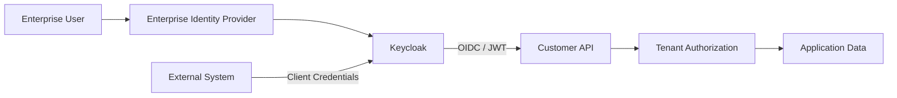

# Customer API — Multi-Tenant Identity with Keycloak

A small .NET customer API used to demonstrate **enterprise identity and multi-tenant API security**.

This is a local demonstration, not a production platform. Keycloak issues identity. The API owns tenant isolation and domain authorization.

## What This Demonstrates

* OAuth2 / OIDC
* Keycloak
* JWT API authentication
* RBAC
* Tenant isolation
* Client Credentials
* Identity brokering architecture
* Docker Compose
* Kubernetes
* Automated authorization tests

## Architecture



```text
Authentication
      ↓
Keycloak

Identity Context
      ↓
JWT

Tenant + Role Authorization
      ↓
.NET API
```

Keycloak authenticates users and machines, federates enterprise IdPs, and issues access tokens.

The Customer API validates those tokens, maps roles to policies, and enforces tenant ownership in application code and persistence. Callers cannot choose a tenant by sending `tenant_id` in a body, query string, header, or route.

## Authorization Model

Application roles live on the `customer-api` Keycloak client so the API contract is explicit. Controllers use named policies, not raw role strings.

| Operation            | PlatformAdmin | CustomerAdmin | Operator | Viewer | ServiceClient |
| -------------------- | ------------: | ------------: | -------: | -----: | ------------: |
| Read customers       |           Yes |           Yes |      Yes |    Yes |           Yes |
| Create customer data |           Yes |           Yes |      Yes |     No |            No |
| Update customer data |           Yes |           Yes |      Yes |     No |            No |
| Delete customer data |           Yes |           Yes |       No |     No |            No |
| Cross-tenant access  |           Yes |            No |       No |     No |            No |

`ServiceClient` is a machine role with **read-only** access inside its configured tenant. It is never mapped to `PlatformAdmin`.

`PlatformAdmin` may read across tenants. Creating a customer still requires a `tenant_id` claim so records are never written without an owner.

## Multi-Tenant Security

Tenant context comes from trusted token claims.

Clients cannot choose their tenant simply by passing `tenant_id` in an API request.

- `customer-a` users only see `customer-a` rows.
- `customer-a` requesting a `customer-b` id receives **404 Not Found**.
- `PlatformAdmin` cross-tenant reads are explicit and covered by tests.

## Running Locally

Requires Docker and the .NET 10 SDK.

```bash
docker compose up -d
dotnet run --project src/Customer.Api
```

| | |
|---|---|
| Keycloak | http://localhost:8080 |
| Keycloak Admin | http://localhost:8080 (local admin from `.env.example`) |
| API | http://localhost:5080 |
| Swagger | http://localhost:5080/swagger |

Optional: `cp .env.example .env` and `docker compose --profile api up -d --build` to run the API in Docker as well.

Realm `customer-api-demo` is imported automatically. No Admin UI configuration is required for the demo.

## Demo Users

**LOCAL DEVELOPMENT / DEMONSTRATION ONLY.** These passwords are throwaway values in the realm import. They are not production credentials.

Shared demo password: `DevPassword123!`

| Username | `tenant_id` | Role |
|---|---|---|
| `alice-admin` | `customer-a` | `CustomerAdmin` |
| `alice-operator` | `customer-a` | `Operator` |
| `bob-admin` | `customer-b` | `CustomerAdmin` |
| `bob-viewer` | `customer-b` | `Viewer` |
| `platform-admin` | _(none)_ | `PlatformAdmin` |

Keycloak's own admin console login is the local `KEYCLOAK_ADMIN` value from `.env.example`.

## Human Authentication

Interactive login uses **Authorization Code + PKCE** through Swagger. Resource Owner Password Credentials is not the demo login flow.

1. Start Keycloak: `docker compose up -d`
2. Start the API: `dotnet run --project src/Customer.Api`
3. Open http://localhost:5080/swagger
4. Click **Authorize**
5. Sign in as a demo user, for example `alice-admin`
6. Call `GET /api/me`, then `/api/customers`

## Machine Authentication

The confidential client `customer-a-integration` uses **OAuth2 Client Credentials**. It is bound to `customer-a` and the `ServiceClient` role.

```bash
TOKEN=$(curl -sS -X POST "$KEYCLOAK_URL/realms/customer-api-demo/protocol/openid-connect/token" \
  -H "Content-Type: application/x-www-form-urlencoded" \
  -d "grant_type=client_credentials" \
  -d "client_id=customer-a-integration" \
  -d "client_secret=$CLIENT_SECRET" \
  | python3 -c 'import json,sys; print(json.load(sys.stdin)["access_token"])')

curl -H "Authorization: Bearer $TOKEN" \
  http://localhost:5080/api/customers
```

Set `KEYCLOAK_URL` and `CLIENT_SECRET` from your environment (see `.env.example`). Do not commit real client secrets.

A helper script does the same check:

```bash
cp .env.example .env
./scripts/keycloak-smoke-test.sh
```

PowerShell: `./scripts/keycloak-smoke-test.ps1`

## Security Tests

```bash
dotnet test src/Customer.Api.sln
```

CI and `dotnet test` use a deterministic test JWT handler. They do **not** require Keycloak. The smoke script above is the live-token check.

## Identity Brokering

```text
Entra / Okta / SAML
        ↓
     Keycloak
        ↓
       API
```

This repository does not integrate a paid enterprise IdP. The API only consumes a normalized JWT. How brokering would fit is documented in [docs/identity-architecture.md](docs/identity-architecture.md).

## Kubernetes

[infra/kubernetes](infra/kubernetes) contains a small Deployment and Service example: image, ports, authentication settings, probes, and resource requests/limits.

These manifests demonstrate deployment concepts. They are **not** a production Keycloak HA topology.

## Production Considerations

### Demo architecture

- Keycloak `start-dev` and an imported realm
- In-memory EF Core store
- Throwaway local users and a local machine-client secret
- HTTP on localhost
- Single-node Docker Compose

### What a real deployment would require

Production Keycloak and API hosting would still need HA/multiple replicas, a production database, TLS, secret management, backups, an upgrade strategy, monitoring, resource sizing, availability targets, network policies, disaster recovery, key rotation, and audit logging.

Those items are intentionally not implemented here.

## Design notes

- [Identity architecture](docs/identity-architecture.md)
- [Security design](docs/security-design.md)
- [ADRs](docs/adr)
- Leftover AWS Lambda / Terraform files under `src/` are not part of this sample.
