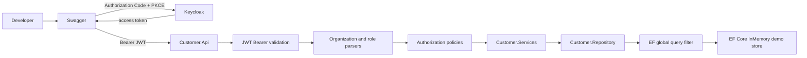

# Multi-Tenant Identity & Authorization with ASP.NET Core and Keycloak

Sample code for a **Staff Software Engineer (IAM / Keycloak)** discussion. It shows how I would orchestrate identity and authorization for a multi-tenant B2B API—the same class of problem as a TMS, where shippers, carriers, and platform operators share one platform but must never see each other's data.

This is independent sample code, not a Mastery product and not a production deployment.

The API is a **resource server**. Keycloak issues tokens. The application validates them, resolves the tenant from the organization claim, and enforces access with policies plus an EF Core query filter.

## What this demonstrates

- OAuth 2.0 / OIDC JWT Bearer validation (issuer, signature, audience, expiry)
- Keycloak 26 Organizations as tenants in **one realm** (`customer-platform`)
- Tenant identity from the **token only**—never from headers, routes, or request bodies
- Policy-based authorization (`Customers.Read/Write`, `Tenant.Manage`, `Platform.Manage`)
- Defense-in-depth data isolation and 404 on cross-tenant object access
- Swagger Authorization Code + PKCE against a public client (no committed secret)
- Deterministic security tests that do not require a live Keycloak for CI

## Architecture



EF Core InMemory is only here so the demo stays self-contained. It is not a production database.

## Getting started

Requires the .NET 10 SDK and Docker.

```bash
docker compose up keycloak
dotnet run --project src/Customer.Api
```

| | |
|---|---|
| API / Swagger | http://localhost:5080/swagger |
| Keycloak | http://localhost:8080 |

After the first Keycloak import, attach demo users to organizations. Steps and pinned organization IDs are in [keycloak/README.md](keycloak/README.md).

## Demo users

Fake local-development password: `DevPassword123!`  
Keycloak admin: `admin` / `admin` (local only)

| Username | Organization | Role |
|---|---|---|
| `acme.reader` | Acme Bank | `tenant-reader` |
| `acme.editor` | Acme Bank | `tenant-editor` |
| `acme.admin` | Acme Bank | `tenant-admin` |
| `contoso.reader` | Contoso Finance | `tenant-reader` |
| `contoso.editor` | Contoso Finance | `tenant-editor` |
| `contoso.admin` | Contoso Finance | `tenant-admin` |
| `platform.admin` | none | `platform-admin` |

In Swagger: **Authorize**, sign in, select an organization if prompted, then call `GET /api/me` and the customer endpoints.

An Acme token cannot read a Contoso customer by ID (404, not 403). `TenantId` in a request body is ignored.

## Authorization mapping

| Keycloak client role | Permissions |
|---|---|
| `tenant-reader` | `Customers.Read` |
| `tenant-editor` | `Customers.Read`, `Customers.Write` |
| `tenant-admin` | those plus `Tenant.Manage` |
| `platform-admin` | `Platform.Manage` only |

`platform-admin` is not a superuser over tenant data. Platform and tenant control planes stay separate.

## Tests

```bash
dotnet test src/Customer.Api.sln
```

The default suite uses locally signed JWTs and stays off the network. Optional Keycloak checks are skipped unless you pass `--filter Category=Keycloak`.

## Docs

- [Architecture](docs/architecture.md)
- [Authentication flow](docs/authentication-flow.md)
- [Authorization model](docs/authorization-model.md)
- [Multi-tenancy](docs/multi-tenancy.md)
- [Threat model](docs/threat-model.md)
- ADRs: [organizations vs realms](docs/adr/001-keycloak-organizations-vs-realms.md) · [tenant from token](docs/adr/002-tenant-resolution-from-token.md) · [policies](docs/adr/003-policy-based-authorization.md) · [data isolation](docs/adr/004-tenant-data-isolation.md)

## Demo limits

`start-dev`, InMemory persistence, and demo passwords are local-only. A production TMS would still need a real database, Keycloak in production mode, HTTPS, token lifetime/revocation, and confidential clients for service-to-service calls. Leftover Lambda/Terraform files in `src/` are not part of this sample.
